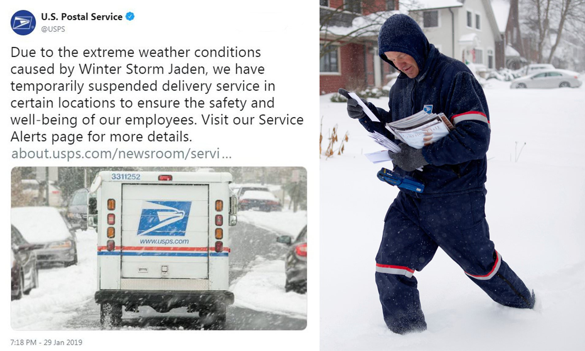
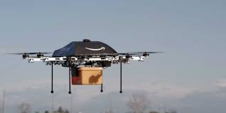
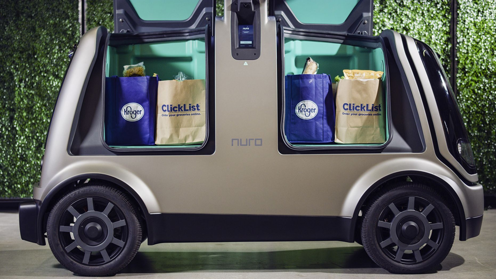

# Monte Carlo Simulation for a Package/ courier delivery service system
### Idea behind our project proposal :-
Over the years it has been seen that the most package delivery companies cancel or suspend their service due to extreme weather. The reason for them to do so is because of the employees life being at great risk. We are prosposing a model to mitigate this risk. 

##### Our Proposals :-
We have two proposals to solve this problem
### Project Proposal 1 :-
#### Drone Package Delivery System -
We belive that in order to mitigate the human risk, the use of drones can be used to deliver the packages accordingly.
Pilot experiments regarding the same have been performed by companies like Amazon, DHL, EasyJet and many more.
With the advancement of technology, using Drones for package delivery can be possible.

### Project Proposal 2:-
#### Self-Driving Cars to deliver Packages
We belive that in order to mitigate the human risk, the use of Self-Driving Cars can be used to deliver the packages accordingly.
A similar idea has been implemented where self-driving cars have been used to deliver groceries in Texas.
We are aware that Self-driving cars are expensive and don't have optimum accuracy when it comes to extreme weather but 
With the advancement of technology, using Self-driving cars for package delivery can be possible.

### Hypothesis 1 :-
There is a relation between the number of workers and the time it takes to load and unload the packages
> More number of workers will result in lesser loading/ Unloading time , Less number of workers will take more loading/ Unloading time

### Hypothesis 2:-
> When the Extreme weather count for a specefic region increases, the difference in the success rates for package delivery increases for the proposed model 

# Computing the cost model
Since we have suggested two ideas in order to mitigate the human life risk on bad weather days, it is extremely essential to check if implementing the model is actually financially feasible. Therefore we calculated the cost including the production and maintenance cost for both the models which basically tells us which region we can apply our model into. If a region as 'x' number of bad days then is it feasible for them to apply the model or will go in a loss? The constructed cost model essentially answers this question
